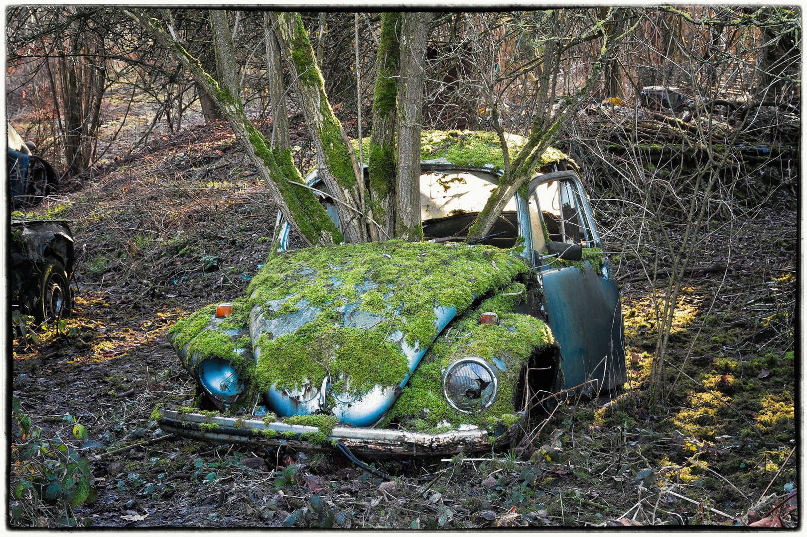
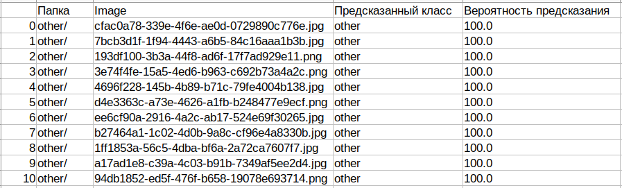
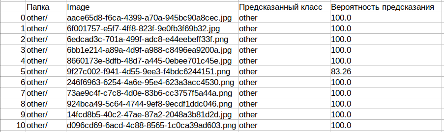

# :blue_car::deciduous_tree:pytorch_img_classification
Classification of 3000 images (with markup json-file) using python, pytorch and neural network.

# Project description
Using python and dataset from this [link](https://drive.google.com/drive/folders/1wHOf6eGv2esYtqFbBuGW9eigoZhRDmMZ?usp=sharing), build and train a model:
* that identifies **cars** and **plants**, among the proposed images, 
* and displays a list of files in each category with the probability of a match.
# Process
All process of work is fully described in Сила_Света_PyTorch.ipynb
# Result
As a result we have 2 csv-files (for train and valid data) - with name of the image, its location (folder), definition to a class and probability of that:

csv-file of train_data:

csv-file of valid_data:
